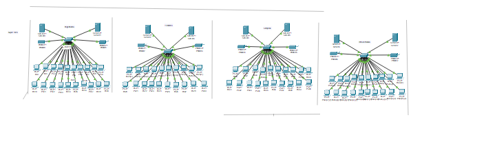
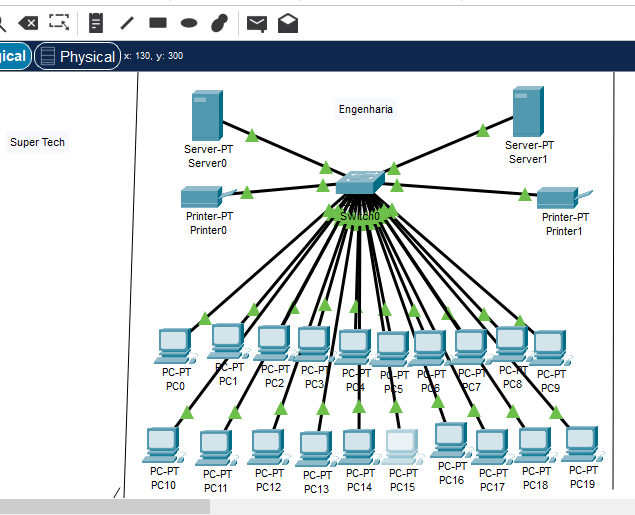
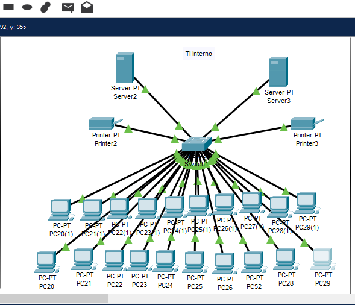
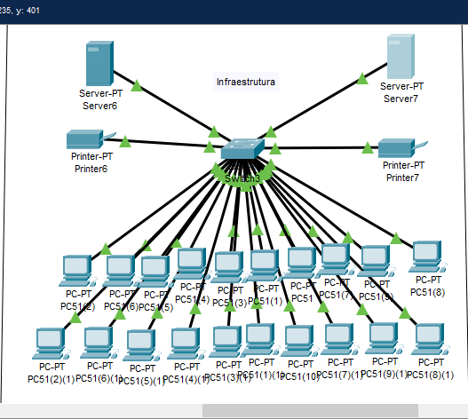

# Rede-Computadores
# Implementação de Rede Local - Empresa Super Tech
### Projeto de Infraestrutura, Sub-redes e VLANs

## 📝 Descrição do Projeto
Este relatório detalha a implementação de uma rede de internet para a empresa **Super Tech**. O foco do projeto foi a segmentação da rede para garantir segurança, organização e escalabilidade.
## 🖼️ Topologia da Rede
Aqui estão os prints das configurações realizadas no simulador:
### Visão Geral da Rede

### Detalhamento por Setores
* **Setor Engenharia:** 
---
* **Setor TI interno:** 
---
* **Setor Compras:**
---
* **Setor Infraestrutura:**

## 🛠️ Especificações Técnicas
* **Segmentação:** Criação de 4 Sub-redes distintas.
* **Organização:** Divisão de grupos em **IP Estático** (servidores/impressoras) e **IP Dinâmico** (estações de trabalho) via DHCP.
* **VLANs:** Implementação de VLANs para isolar o tráfego de cada sub-rede.
* **Hardware Utilizado:** * Switch Cisco 2950-24 (24 portas).
  * Recomendação de upgrade para Switch 2960 para expansão futura.

## 📄 Documentação Completa
O relatório técnico detalhando as configurações e a topologia está disponível no link abaixo:
👉 **[Ver Relatório de Aula Prática (PDF)](./C:/Users/Daiana/Downloads/Relatório%20Super%20Tech.pdf.pdf)**

## 🚀 Habilidades Demonstradas
* Configuração de Switches
* Planejamento de Endereçamento IP
* Implementação de VLANs
* Escalabilidade de Infraestrutura de TI
* Arquitetura de Rede
---

*Trabalho acadêmico desenvolvido por Daiana Paula Fernandes*
